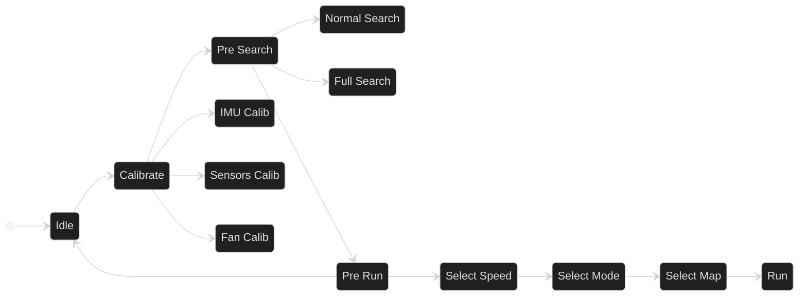

O firmware é feito em C++ e é estruturado em máquina de estados. O código completo está disponível em https://github.com/team-raiju/fujin

Em alto nível, temos os seguintes estados:

- **Idle**: Estado inicial de standby, todos os sensores desativados para economizar bateria. Aceita comandos de USB e bluetooth para envio de configurações, e requests de logs e mapas armazenados no robô.

- **Calib**: Permite seleção do modo de calibração
    - **Sensors Calib**: Estado para calibração dos sensores. O valor bruto dos sensores IR de distância são lidos e transmitidos continuamente por bluetooth. Utilizamos esse estado para ver o valor em diversas configurações, como no meio da célula (para ver o valor de referência para o PID de alinhamento do robô) e o valor no começo da célula com diversas configurações de parede (para calibrar o limiar de detecção de parede para cada sensor)
    - **IMU calib**: O giroscópio do IMU possui um _offset_ mesmo quando em repouso. Nesse modo deixamos o robô estacionário e medimos esse offset, para posteriormente descontar esse valor nas medições do IMU.
    - **Fan Calib**: Gira a ventoinha em uma velocidade configurada pelo aplicativo. Útil para validar seu funcionamento e a downforce que está exercendo

- **Pre search**: Aguarda início do modo de busca
    - **Normal Search**: Realiza uma busca para o "objetivo" do labirinto utilizando flood-fill. Depois, volta para a origem do labirinto usando o mesmo algoritmo, mas priorizando rotas desconhecidas
    - **Full search**: Realiza uma busca para o "objetivo" do labirinto utilizando flood-fill. Mas, na volta, percorre todas as células não visitadas antes de voltar para a origem.

- **Pre Run**: Aguarda o início da volta rápida
    - **Select Speed**: O robô possui 4 modos de velocidade ja pré configurados. Isto é, perfils de velocidade com parâmetros que ja foram calibrados para esse velocidade. os modos são "Slow"; "Medium" e "Fast", como descritos em [Parâmetros Atuais](#mec_params)
    - **Select Mode**: Escolhe 1 dentre os 3 modos de operação para a sequencia de movimentos que irá realizar: **Hard-codded** (movimentos ja definidos no código ou pelo bluetooh); **Smooth** (Sequencia normal de movimentos calculada a partir do mapa do robô) e **Diagonals** (Sequencia de movimentos calculada a partir do mapa do robô mas utilizando diagonais).
    - **Select Map**: O robô armazena dois mapas em sua memória. O primeiro só considerando o mapa que salvou no modo search apenas no caminho de ida até o objetivo, e o segundo mapa, o mapa completo que gerou após voltar para a origem. Este backup serve para o caso de o robô se perder na volta do search.
    - **Run**: Modo que o robô efetivamente realiza a sequencia de movimentos desejada. Roda um loop de controle a cada 1ms para controlar o movimento e leitura dos sensores.
