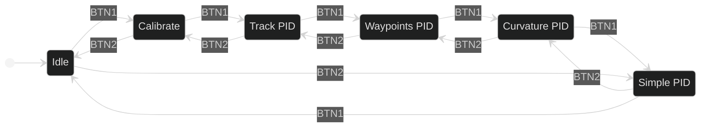

O controle principal do robô é feito através de uma máquina de estados. No mais alto nível, os principais estados do código podem ser vistos abaixo, cada um define a rotina que acontecerá quando o robô receber um evento de _start_.

**Idle:** Estado inicial de standby, não aceita comandos de _start_ e permite conexão USB para manipulção de dados da pista.

**Simple PID:** PID clássico com velocidade constante usando apenas os sensores de linha. Não é utilizado em tomadas de tempo oficial, porém é útil em testes.

**Curvature PID**: Volta otimizada, aumentando a velocidade nas retas e diminuindo nas curvas.

**Waypoints PID**: Volta sem a utilização dos sensores de linha, utilizando apenas o mapeamento, IMU e encoders. Ainda não foi otimizado completamente.

**Track PID**: O mesmo que o Simple PID, porém a posição atual do robô (calculada a partir do encoder e do IMU) é salva a cada 5 cm. Usada para mapeamento.

**Calibrate**: Calibra os sensores de linha e o IMU e salva os valores na memória não volátil, assim só é necessário realizar uma vez por competição.
